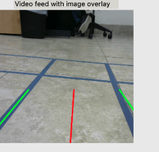
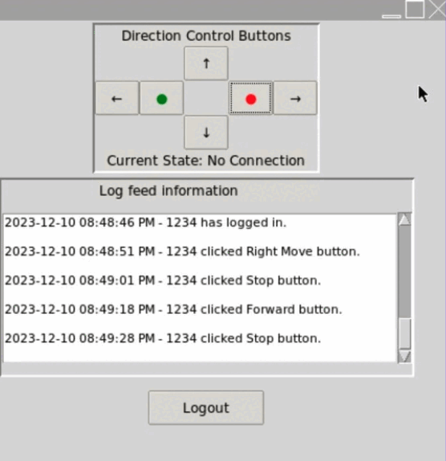

| Lane Detection GIF | Demo Video GIF |
| ------------------ | -------------- |
|  |  |


# Robot Control and Detection System

This project provides a comprehensive system for robot control, lane detection, and obstacle detection. It includes a Flask server for controlling robot movement, a Tkinter GUI for user interaction, a database for user registration and login, and OpenCV-based video processing for real-time lane and obstacle detection.


### Project Overview

The project integrates a Tkinter-based GUI for robot control, a Flask backend for handling RESTful API requests to move the robot, and OpenCV for video feed processing. The application allows users to control a robot via a web interface, log in and register, and visualize lane detection and obstacle detection from the camera feed.

---

### Features

1. **Flask Backend for Robot Control**:
   - Robot movement commands via a RESTful API.
   - Lane-following and centerline tracking using OpenCV.
   - Integrated obstacle detection and lane segmentation.

2. **Tkinter GUI for User Interface**:
   - User registration and login.
   - Real-time webcam feed display and control buttons for the robot.
   - Logging of user activity.

3. **SQLite Database for User Management**:
   - Stores user information securely.
   - Ensures that password storage uses hashing and salting.

4. **OpenCV-Based Video Processing**:
   - Lane and obstacle detection for lane-following.
   - Real-time video stream processing and display.
   - Centerline calculation and navigation adjustments.

---

### Installation

#### Prerequisites

- **Python 3.7+**
- Required libraries (Install via `pip`):
  ```bash
  pip install opencv-python-headless flask flask-cors bcrypt pillow pytz
